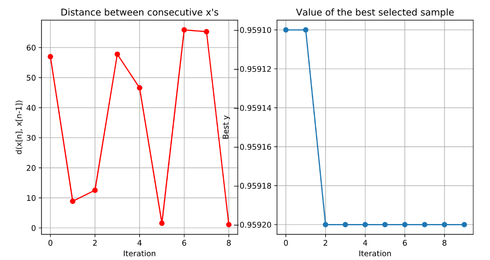

# bayesHyperSearch
Hyperparameter Search On Machine Learning Models Using Bayesian Optimization

Model aganostic wrapper whcich runs [GpyOpt](https://sheffieldml.github.io/GPyOpt/) in the backend.
 
Tutorials For Keras and Scikit Learn Models
-----

1) [Keras Example](demoKerasMNIST.py)
2) [Scikit Example](demoSklearnMNIST.py)

Sample Ouput
------

Reference 
---------

Bayesian Optimization using GPs - [Video](https://www.youtube.com/watch?list=PLZ_xn3EIbxZHoq8A3-2F4_rLyy61vkEpU&time_continue=1&v=EnXxO3BAgYk&feature=emb_logo ) 

